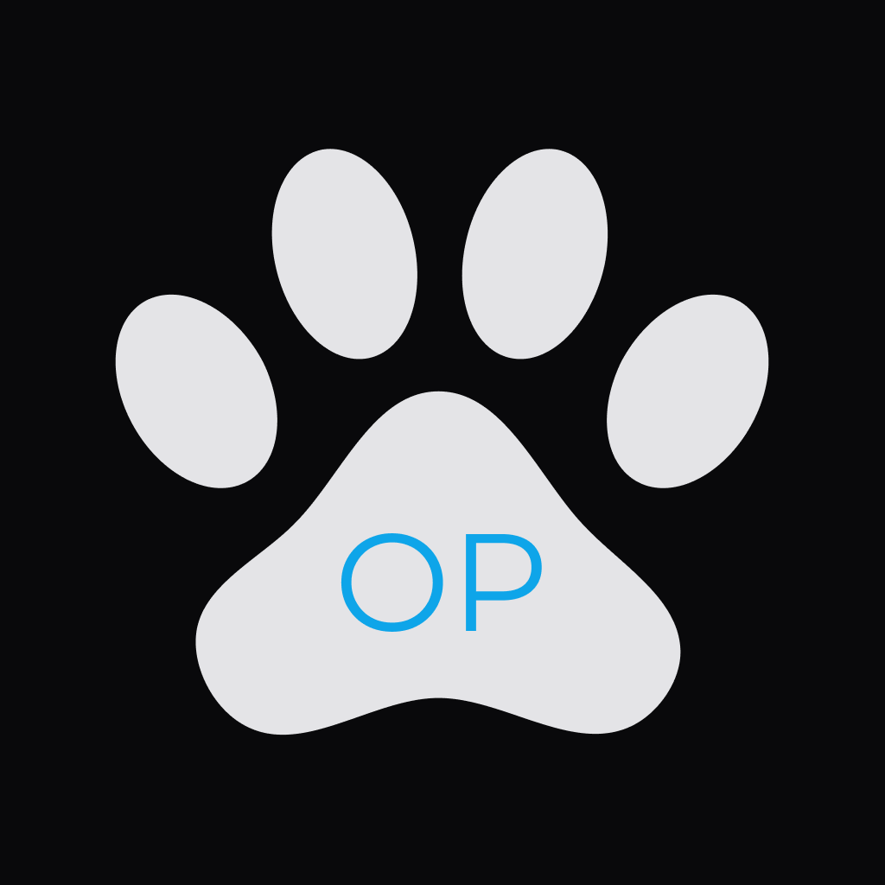

# OnlyPaws Mobile App 



<br />
<br />

_The unapologetically pet friendly social media app._

---

## Table of Contents

1. [Creating IOS Build](#creating-ios-build)
2. [Creating Android Build](#creating-android-build)
3. [Running Dev Client](#run-dev-client)
4. [Running Dev Client During Testing](#run-dev-client-during-testing)
5. [Running Tests](#running-tests)
6. [Creating EAS Development Build](#creating-eas-development-build)

---

### Creating IOS Build
```bash
npx expo prebuild --platform ios
npx expo run:ios
```

### Creating Android Build
```bash
npx expo prebuild --platform android
npx expo run:android --device
```

### Run dev client
```bash
npx expo start --dev-client  
```

### Run dev client During Testing
--no-dev prevents the splash screen warning from blocking the tabs
--minify minifies the app code
```bash
npx expo start --no-dev --dev-client
npx expo start --no-dev --minify --dev-client 
```

### Running Tests
```bash
maestro test e2e/
```

### Help writing tests with maestro studio

Maestro Studio is a UI platform to facilitate writing tests. To open maestro studio, run the following command:
```bash
maestro studio 
```

### Creating EAS Development Build
```bash
eas build --profile development --platform ios --message "With react content loader."
```
